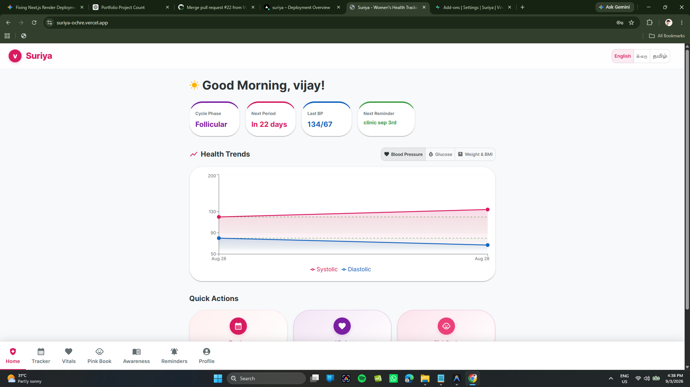
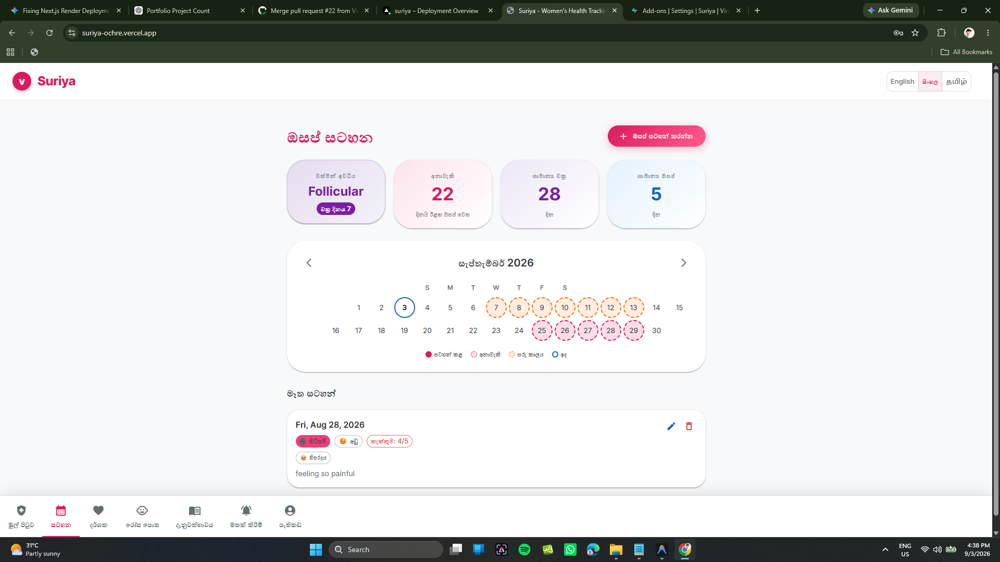
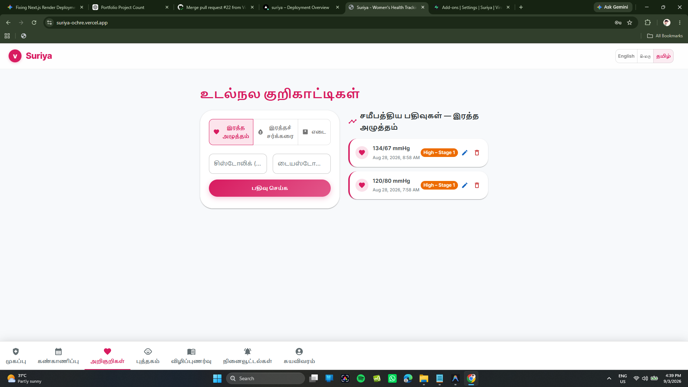
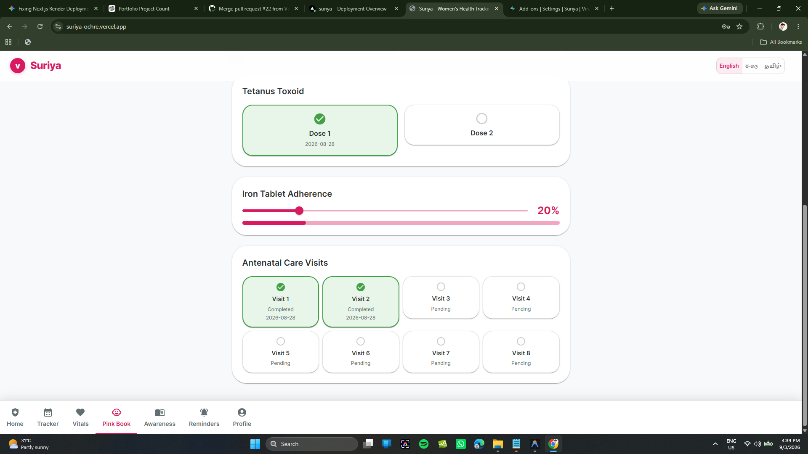
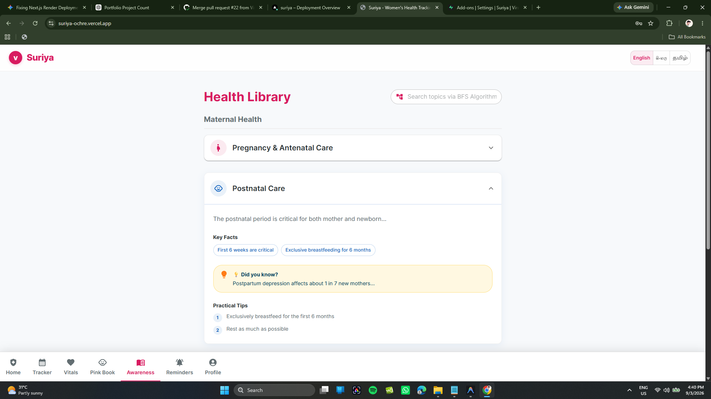
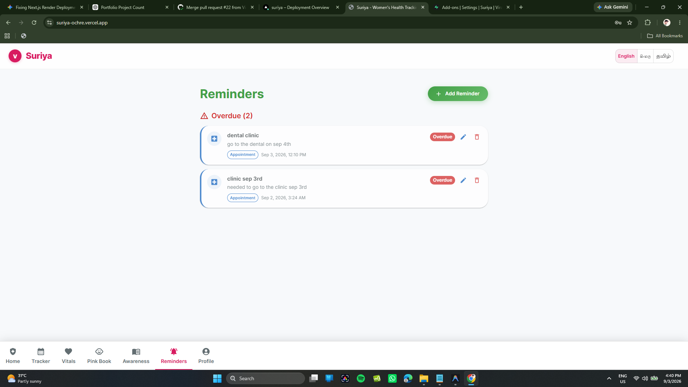
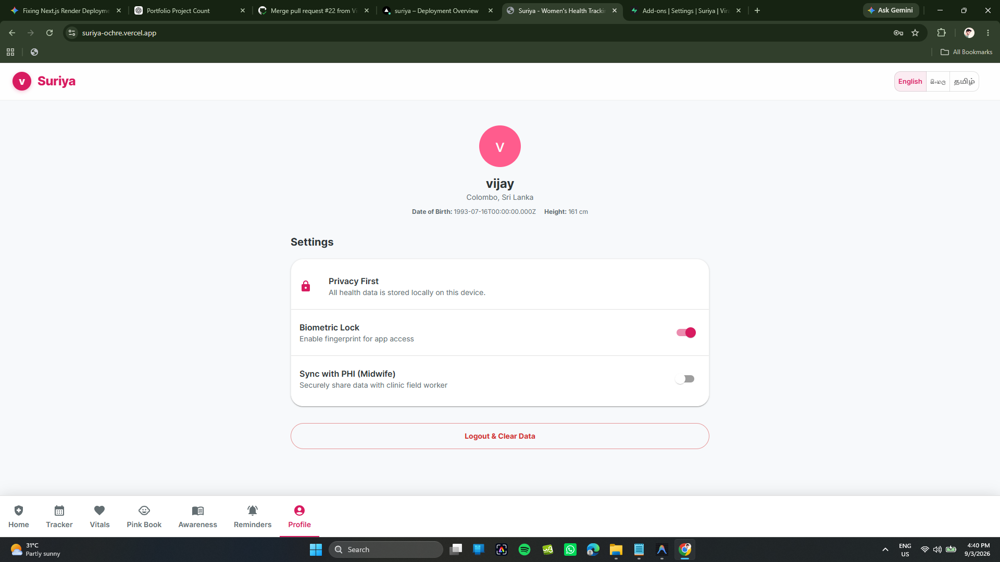

# Suriya Women's Health Tracking System 🌸

**Empowering women in low-resource environments with accessible, localized, and secure health tracking.**

[View Live Site](suriya-ochre.vercel.app)

## 📖 About The Project

Suriya is a comprehensive, full-stack web application designed to bridge the gap in maternal and menstrual healthcare for women in low-resource settings, specifically tailored for Sri Lanka. It digitizes the traditional maternal health "Pink Book", tracks menstrual cycles, monitors vital signs, and manages localized health awareness content in English, Sinhala, and Tamil. 

By utilizing advanced graph algorithms (Kruskal's) for community clinic networking and custom priority queues for health reminders, Suriya ensures efficient resource allocation and timely medical alerts.

### ✨ Key Features

*   **📱 Trilingual Interface:** Fully localized in English, Sinhala, and Tamil.
*   **🩸 Menstrual & Cycle Tracking:** Intelligent tracking with phase prediction.
*   **💓 Vitals Monitoring:** Log and analyze blood pressure, glucose, and weight over time.
*   **👶 Digital "Pink Book":** A digital replacement for the traditional maternal and child health record.
*   **🔔 Intelligent Reminders:** Priority-queue based reminder system for medications and appointments.
*   **🔒 High Security:** AES-256 encrypted data storage to protect sensitive health information.

---

## 📸 Application Showcase

### User Interface

| Dashboard (Home) | Menstrual Tracker |
| :---: | :---: |
|  |  |
| **Vitals Logger** | **Digital Pink Book** |
|  |  |
| **Health Awareness** | **Reminders** |
|  |  |
| **User Profile** |
|  |

---

## 🗺️ Development Roadmap

- [x] **Phase 1: Core Architecture & Setup** (Next.js, Prisma, PostgreSQL setup)
- [x] **Phase 2: Authentication & Security** (NextAuth, AES-256 data encryption)
- [x] **Phase 3: Core Health Features** (Menstrual tracking, Vital logging, Pink Book)
- [x] **Phase 4: Algorithms & Localization** (Kruskal's MST, Priority Queues, i18n support)
- [x] **Phase 5: CI/CD & Testing** (Docker, GitHub Actions, Jest, Playwright)
- [ ] **Phase 6: Admin/Midwife Portal** (Dashboard for healthcare providers)
- [ ] **Phase 7: Offline PWA Support** (Service workers for rural accessibility)

---

## 🏗️ Technical Documentation

For an in-depth look at how the application is built, please refer to the extended documentation:

*   **[System Architecture](./docs/system_architecture.md):** Detailed breakdown of the Next.js App Router, database schema, and deployment strategy.
*   **[Engineering Decisions](./docs/engineering_decisions.md):** Insights into the algorithms used (Kruskal's, Merge Sort), security measures, and CI/CD pipelines.
*   **[Design Decisions](./docs/design_decisions.md):** Rationale behind the UI/UX, color theory, accessibility, and Material-UI implementation.

---

## 📄 License

This is a portfolio and educational project. The source code is provided for review purposes only.

---

## 📬 Contact

📧 Email: virajtharindu1997@gmail.com  
💼 LinkedIn: https://www.linkedin.com/in/viraj-tharindu/  
🌐 Portfolio: [Visit my portfolio](https://virajtharindu.com)  
🐙 Project Link: [https://github.com/VirajTharindu/Surya-Women-s-Health-Tracing-and-Monitoring-System-Web-App-NextJS-FullStack](https://github.com/VirajTharindu/Surya-Women-s-Health-Tracing-and-Monitoring-System-Web-App-NextJS-FullStack)*
