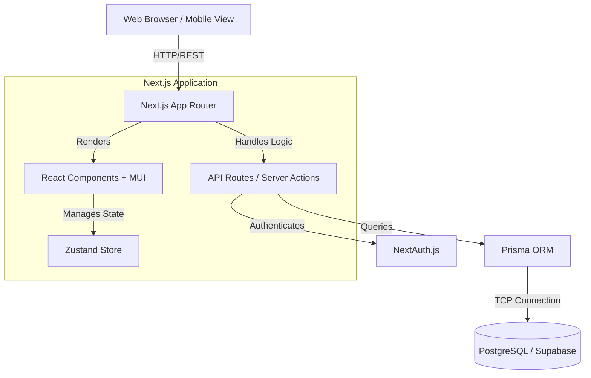

# System Architecture

## Overview

Suriya Women's Health Tracking is a comprehensive full-stack web application designed for maternal and menstrual health monitoring. It is built to operate robustly in low-resource environments, utilizing modern web technologies and a decoupled frontend-backend architecture unified within the Next.js App Router framework.

## Technology Stack

### Frontend (Client-Side)
*   **Framework:** Next.js 14+ (App Router)
*   **UI Library:** React 18
*   **Component Library:** Material-UI (MUI) v5
*   **State Management:** Zustand (for global application state)
*   **Styling:** Emotion (CSS-in-JS via MUI)
*   **Localization:** next-i18next / i18next (English, Sinhala, Tamil)

### Backend (Server-Side)
*   **API Framework:** Next.js API Routes (Serverless Functions)
*   **Authentication:** NextAuth.js (Auth.js) v5 with Credentials provider
*   **Database ORM:** Prisma ORM v7
*   **Database:** PostgreSQL (hosted via Supabase)
*   **Security:** AES-256-GCM Encryption for sensitive data

### Infrastructure & CI/CD
*   **Deployment Platform:** Vercel (Production & Staging)
*   **Containerization:** Docker (for local development and alternative deployment)
*   **CI/CD Pipeline:** GitHub Actions
*   **Testing:** Jest (Unit/Integration), Playwright (E2E), K6 (Performance)

---

## Architectural Diagram (High-Level)

## Core Modules

### 1. Presentation Layer (`src/components/`, `src/app/page.tsx`)
The presentation layer is heavily modularized. Dynamic imports are utilized in the main `page.tsx` to ensure that heavy components (like the Calendar or Charts) are only loaded when their respective tabs are activated by the user.

### 2. State Management (`src/store/useHealthStore.ts`)
Zustand is used as a lightweight, centralized state container. It manages:
*   User Profile and Preferences (Language)
*   Menstrual Cycle Logs and Predictions
*   Vital Logs (Blood Pressure, Glucose, Weight)
*   Reminders (Prioritized Queue)

### 3. API Layer (`src/app/api/`)
Serverless API endpoints handle business logic, data validation (via custom validation functions), and database interactions. Rate limiting is implemented globally at the middleware level (`src/middleware.ts`) to prevent abuse.

### 4. Database Schema (`prisma/schema.prisma`)
The PostgreSQL database is structured with strong relational integrity. Key models include:
*   `User`: Core identity and authentication.
*   `CycleLog`: Records menstrual data.
*   `VitalLog`: Stores health metrics with flexible JSON fields.
*   `PinkBook`: A specialized record for maternal and child health (digitizing the traditional Sri Lankan "Pink Book").
*   `Reminder`: Task tracking.
*   `Clinic` & `ClinicEdge`: Graph data structures for the community health network.
